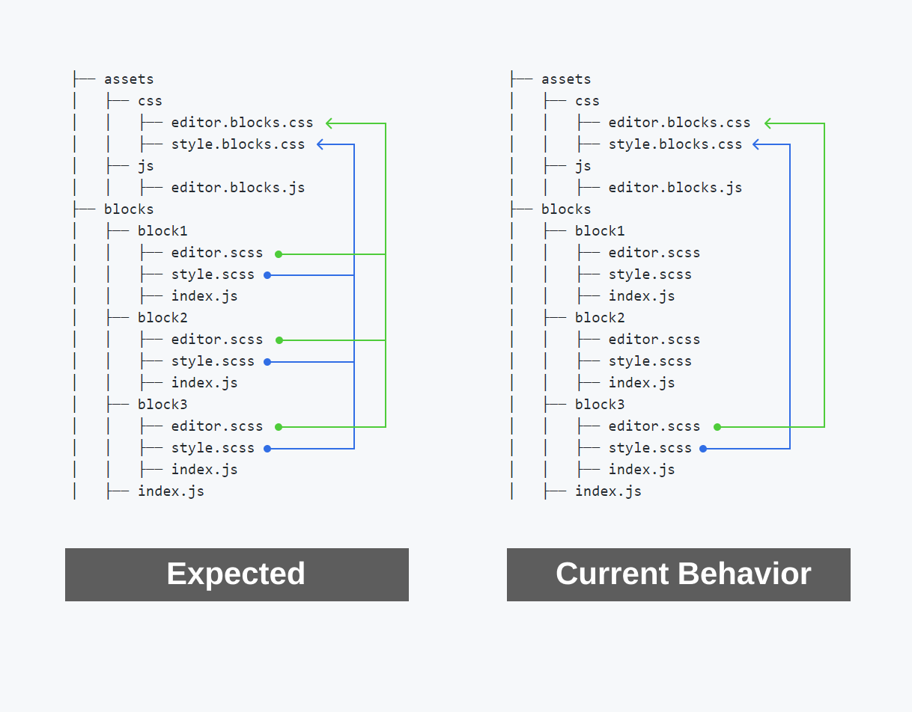

# Multiple webpack CSS Files

Demo project to extract CSS from different named SASS files (`style.scss` and `editor.scss`) and compile them down to specific CSS files (`block.styles.css` and `editor.styles.css`).

Take a look at the following project which has the project source code inside the `./blocks` folder and the compiled code in the `./assets` folder.

```bash
├── assets
│   ├── css
│   │   ├── editor.blocks.css
│   │   ├── style.blocks.css
│   ├── js
│   │   ├── editor.blocks.js
├── blocks
│   ├── block1
│   │   ├── editor.scss
│   │   ├── style.scss
│   │   ├── index.js
│   ├── block2
│   │   ├── editor.scss
│   │   ├── style.scss
│   │   ├── index.js
│   ├── block3
│   │   ├── editor.scss
│   │   ├── style.scss
│   │   ├── index.js
│   ├── index.js
```

The project has a single entry point is `./blocks/index.js` which includes each of the other `index.js` files inside each block. Each block `index.js` file in turn includes the `editor.sccs` and `style.scss` for that block.

When webpack runs it:

* Concatenates and compiles all `style.scss` files to `./assets/css/block.styles.css`.
* Concatenates and compiles all `editor.scss` files to `./assets/css/editor.styles.css`.



The only caveat to this working properly was that during the bundling process two extra JS files were being emitted. This apparently is a known issue in webpack 3/4 and is supposedly working as expected in webpack 5. In the meantime I'm using the `ignore-emit-webpack-plugin' package to remove the unecessary JS files from the bundle.

# To Run the webpack Script

* Clone the repo.
* `npm init`
* `npm run build`
