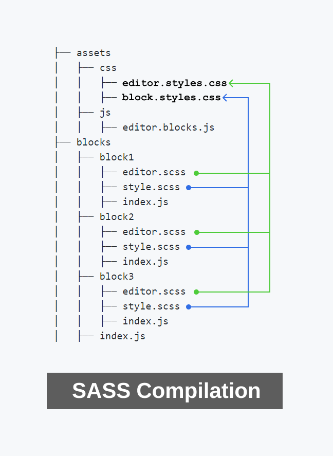

# Multiple webpack CSS Files

Demo repo to attempt extracting CSS from different named SASS files and compile them down to specific CSS files.

Take a look at the following project which has the project source code inside the `./blocks` folder and the compiled code in the `./assets` folder.

The project has a single entry point is `./blocks/index.js` which includees each of the other `index.js` files inside each block. Each block `index.js` file includes the `editor.sccs` and `style.scss` for that block.

```bash
├── assets
│   ├── css
│   │   ├── editor.blocks.css
│   │   ├── style.blocks.css
│   ├── js
│   │   ├── editor.blocks.js
├── blocks
│   ├── block1
│   │   ├── editor.scss
│   │   ├── style.scss
│   │   ├── index.js
│   ├── block2
│   │   ├── editor.scss
│   │   ├── style.scss
│   │   ├── index.js
│   ├── block3
│   │   ├── editor.scss
│   │   ├── style.scss
│   │   ├── index.js
│   ├── index.js
```

When webpack runs it should:

* Concatenate and compile all `style.scss` files to `./assets/css/style.blocks.css`.
* Concatenate and compile all `editor.scss` files to `./assets/css/editor.blocks.css`.

At the moment, instead of concatenating and compiling all `style.scss` and `editor.scss` files it seems to grab the SASS from the LAST block folder only. This indicates that `style.blocks.css` and `editor.blocks.css` are continuously being overwritten which is incorrect.

Here's a visual of what's currently happening vs the expected behavior.



# To Run the webpack Script

* Clone the repo.
* `npm init`
* `npm run build`
